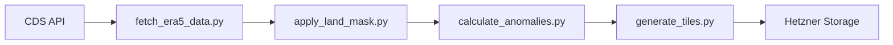

# Introduction


Phase 11 completes the ERA5-Land Germany Climate Visualization project by establishing comprehensive documentation, end-to-end testing for critical user flows, and production deployment infrastructure. This phase ensures the project is maintainable, observable, and production-ready.

**Key Deliverables:**
1. **Architecture Documentation** - Technical docs for pipeline, frontend, and data formats
2. **Operations Runbook** - Procedures for common operations and incident response
3. **E2E Test Suite** - Playwright tests for critical user journeys
4. **Production Deployment** - Cloudflare Pages with custom domain and monitoring
5. **Performance Optimization** - Lighthouse audits and optimization passes

**Current Infrastructure Context:**
- Frontend currently deploys to Scaleway S3 via rclone
- Domain `esistwarm.jetzt` proxied through Cloudflare
- No existing E2E tests in codebase
- Single unit test file exists (`HardinessZoneUtils.test.ts`)

## 0. Preflight & Self-Correction

> **Mandatory gate**: Before starting any task in this phase and after every change, run the preflight script and follow the self-correction loop.

1. **Run preflight**: `./scripts/run-preflight.sh` — all checks must pass before starting work
2. **After each change**: re-run preflight or the targeted test subset (see `docs/self-correct-playbook.md`)
3. **On failure**: follow retry guidance in the playbook (max 3 attempts per issue, then revert and re-analyze)
4. **Local CI parity**: optionally run `./scripts/act-local.sh build` to verify GHA workflows locally (requires Docker + act)

## 0.1 Regular Commits

Commit after each logical unit of work to maintain a clear and reviewable change history. Avoid accumulating large batches of uncommitted changes — they make it harder to understand what belongs to what, harder to review PRs, and harder to revert individual changes if something goes wrong.

**Guidelines:**
- Commit after completing each task group or implementation sub-section
- Use [Conventional Commits](https://www.conventionalcommits.org/) format: `feat(phase-X):`, `fix(phase-X):`, `chore(phase-X):`, `test(phase-X):`, etc.
- Each commit should pass the preflight checks (see § 0 above)
- Keep PRs focused — one logical concern per PR makes reviews faster and safer

## 1. Requirements & Constraints

### Functional Requirements

- **REQ-P11-001**: All public APIs and data formats must be documented
- **REQ-P11-002**: E2E tests must cover city selection, date navigation, and metric loading
- **REQ-P11-003**: Production deployment must support zero-downtime updates
- **REQ-P11-004**: Operations runbook must cover tile regeneration and rollback procedures
- **REQ-P11-005**: Documentation must be sufficient for new contributors to onboard

### Non-Functional Requirements

- **NFR-P11-001**: E2E tests complete in < 5 minutes in CI
- **NFR-P11-002**: Lighthouse performance score ≥ 90
- **NFR-P11-003**: Documentation generates without errors (if using doc generator)
- **NFR-P11-004**: Production uptime ≥ 99.5%
- **NFR-P11-005**: Deployment from commit to live < 10 minutes

### Constraints

- **CON-P11-001**: Cloudflare Pages free tier: 500 builds/month, 100GB bandwidth/month
- **CON-P11-002**: E2E tests must work in GitHub Actions (headless browser)
- **CON-P11-003**: No budget for external monitoring services (use free tiers only)
- **CON-P11-004**: Documentation must be in Markdown (no proprietary formats)

### Guidelines

- **GUD-P11-001**: Follow existing documentation patterns (YAML frontmatter, process docs)
- **GUD-P11-002**: E2E tests use existing Vitest patterns where applicable
- **GUD-P11-003**: Deployment automation follows existing GitHub Actions patterns
- **GUD-P11-004**: Use existing Cloudflare CDN integration (don't create new)

### Patterns to Follow

- **PAT-P11-001**: GitHub Actions workflow structure (see Code Reference 10.1)
- **PAT-P11-002**: Documentation YAML frontmatter pattern (see Code Reference 10.2)
- **PAT-P11-003**: Vitest test structure (describe/it/expect) (see Code Reference 10.3)
- **PAT-P11-004**: Process documentation format (see Code Reference 10.4)

---

## 2. Implementation Steps

### Implementation Phase 11.1: Architecture Documentation

**GOAL-001**: Create comprehensive technical documentation for all system components

| Task | Description | Completed | Date |
| -------- | --------------------- | --------- | ---- |
| TASK-P11-001 | Create `documentation/architecture/era5-pipeline.md` with pipeline data flow diagrams | | |
| TASK-P11-002 | Create `documentation/architecture/frontend.md` with component hierarchy and Redux flow | | |
| TASK-P11-003 | Create `documentation/architecture/infrastructure.md` with deployment architecture | | |
| TASK-P11-004 | Add JSDoc comments to all public TypeScript functions in services and hooks | | |
| TASK-P11-005 | Add docstrings to all public Python functions in analysis modules | | |

**Completion Criteria:**
- All architecture docs include diagrams (Mermaid format)
- JSDoc/docstrings coverage for public functions
- New contributor can understand system from docs alone

**Documentation templates:**

```markdown
<!-- documentation/architecture/era5-pipeline.md -->
---
title: ERA5-Land Data Pipeline Architecture
last_updated: 2026-02-16
---

# ERA5-Land Data Pipeline

## Overview

Brief description of the pipeline purpose and scope.

## Data Flow



## Components

### 1. Data Fetching (`analysis/era5/fetch_era5_data.py`)

**Purpose**: Downloads ERA5-Land monthly data from Copernicus CDS

**Input**: Year, month, variable name
**Output**: NetCDF file in `data/era5/raw/`

**Configuration**:
| Parameter | Value | Description |
|-----------|-------|-------------|
| `BOUNDS` | 47.2°N-55.1°N, 5.8°E-15.1°E | Germany bounding box |
| `VARIABLES` | `['t2m']` | 2m temperature |

...
```

---

### Implementation Phase 11.2: Data Format Documentation

**GOAL-002**: Document all data formats, schemas, and API contracts

| Task | Description | Completed | Date |
| -------- | --------------------- | --------- | ---- |
| TASK-P11-006 | Create `documentation/data-formats/tiles.md` with tile schema and URL patterns | | |
| TASK-P11-007 | Create `documentation/data-formats/metrics.md` with JSON schema for all metric types | | |
| TASK-P11-008 | Create `documentation/data-formats/cities.md` with city data schema | | |
| TASK-P11-009 | Add JSON Schema files for validation (`schemas/*.json`) | | |
| TASK-P11-010 | Create `documentation/api/internal-api.md` for service layer contracts | | |

**Completion Criteria:**
- All JSON formats have corresponding JSON Schema
- Tile URL patterns documented with examples
- Service contracts define input/output types

**Example data format doc:**

```markdown
<!-- documentation/data-formats/tiles.md -->
---
title: Tile Data Format Specification
version: 1.0
---

# Temperature Anomaly Tiles

## Overview

WebP raster tiles showing temperature anomalies for Germany.

## URL Pattern

```
https://storage.esistwarm.jetzt/tiles/{year}/{month:02d}/{z}/{x}/{y}.webp
```

### Parameters

| Parameter | Type | Range | Example |
|-----------|------|-------|---------|
| `year` | int | 2016-2026 | 2024 |
| `month` | int | 01-12 | 06 |
| `z` | int | 6-10 | 8 |
| `x` | int | varies by z | 134 |
| `y` | int | varies by z | 85 |

### Example URLs

- `https://storage.esistwarm.jetzt/tiles/2024/06/8/134/85.webp`
- `https://storage.esistwarm.jetzt/tiles/2024/01/10/537/340.webp`

## File Specifications

| Property | Value |
|----------|-------|
| Format | WebP with alpha |
| Size | 256x256 pixels |
| Quality | 80% |
| Color space | sRGB |
| Alpha | Land=opaque, Ocean=transparent |

## Color Ramp

| Anomaly (°C) | Color (hex) |
|--------------|-------------|
| -3.0 | `#2166AC` (dark blue) |
| -1.5 | `#67A9CF` (light blue) |
| 0.0 | `#F7F7F7` (white) |
| +1.5 | `#EF8A62` (light red) |
| +3.0 | `#B2182B` (dark red) |

## Caching

- Cache-Control: `public, max-age=86400` (24 hours)
- Historical tiles are immutable (safe to cache indefinitely)
- Current month tiles may update daily
```

---

### Implementation Phase 11.3: Operations Runbook

**GOAL-003**: Create operational procedures for common tasks and incident response

| Task | Description | Completed | Date |
| -------- | --------------------- | --------- | ---- |
| TASK-P11-011 | Create `documentation/deployment/runbook.md` with standard operating procedures | | |
| TASK-P11-012 | Create `documentation/deployment/cloudflare.md` with Cloudflare configuration guide | | |
| TASK-P11-013 | Create `documentation/deployment/troubleshooting.md` with common issues and fixes | | |
| TASK-P11-014 | Create `scripts/ops/regenerate-tiles.sh` for manual tile regeneration | | |
| TASK-P11-015 | Create `scripts/ops/rollback-deployment.sh` for frontend rollback | | |

**Completion Criteria:**
- Runbook covers all common ops tasks
- Scripts are tested and documented
- Troubleshooting guide covers known failure modes

**Runbook template:**

```markdown
<!-- documentation/deployment/runbook.md -->
---
title: Operations Runbook
version: 1.0
last_updated: 2026-02-16
---

# Operations Runbook

## Table of Contents

1. [Daily Operations](#daily-operations)
2. [Incident Response](#incident-response)
3. [Deployment Procedures](#deployment-procedures)
4. [Data Pipeline Operations](#data-pipeline-operations)

---

## Daily Operations

### Health Checks

**Automated**: Cloudflare monitoring checks every 5 minutes

**Manual verification**:
```bash
# Check frontend availability
curl -I https://esistwarm.jetzt

# Check tile availability
curl -I https://storage.esistwarm.jetzt/tiles/2024/06/8/134/85.webp

# Check metrics endpoint
curl https://esistwarm.jetzt/data/era5/metrics/germany.json
```

---

## Incident Response

### Frontend Not Loading

**Symptoms**: Users report blank page or errors

**Diagnosis**:
1. Check Cloudflare status: https://www.cloudflarestatus.com/
2. Check deployment status in GitHub Actions
3. Check browser console for errors

**Resolution**:
1. If Cloudflare issue: Wait for resolution
2. If deployment failed: Trigger rollback (see below)
3. If JavaScript error: Deploy hotfix

### Tiles Not Loading

**Symptoms**: Map shows no data layer

**Diagnosis**:
1. Check Hetzner Storage status
2. Verify tile URL returns 200
3. Check CORS headers

**Resolution**:
1. If storage down: Wait for Hetzner resolution
2. If tiles missing: Trigger tile regeneration job
3. If CORS issue: Check bucket policy

---

## Deployment Procedures

### Standard Frontend Deployment

Automatic on push to `main` branch.

**Manual trigger**:
1. Go to GitHub Actions
2. Select "Build and Deploy Frontend"
3. Click "Run workflow"

### Rollback Frontend

```bash
# Using GitHub CLI
gh run list --workflow=build-and-deploy-frontend-to-s3.yml --limit 5

# Identify last successful run ID, then:
gh run rerun <RUN_ID>
```

Or use the rollback script:
```bash
./scripts/ops/rollback-deployment.sh
```

---

## Data Pipeline Operations

### Trigger Manual Tile Regeneration

For a specific month:
```bash
./scripts/ops/regenerate-tiles.sh 2024 06
```

For all tiles:
```bash
./scripts/ops/regenerate-tiles.sh --all
```

### Invalidate CDN Cache

```bash
# Cloudflare cache purge (requires API token)
curl -X POST "https://api.cloudflare.com/client/v4/zones/${CF_ZONE_ID}/purge_cache" \
     -H "Authorization: Bearer ${CF_API_TOKEN}" \
     -H "Content-Type: application/json" \
     --data '{"purge_everything":true}'
```

### Check Pipeline Status

```bash
# View recent pipeline runs
gh run list --workflow=era5-daily-pipeline.yml --limit 10

# View specific run logs
gh run view <RUN_ID> --log
```
```

---

### Implementation Phase 11.4: E2E Test Suite

**GOAL-004**: Implement end-to-end tests for critical user journeys using Playwright

| Task | Description | Completed | Date |
| -------- | --------------------- | --------- | ---- |
| TASK-P11-016 | Install and configure Playwright (`npm i -D @playwright/test`) | | |
| TASK-P11-017 | Create `frontend/playwright.config.ts` with browser and base URL config | | |
| TASK-P11-018 | Create `frontend/e2e/homepage.spec.ts` - page loads, initial state correct | | |
| TASK-P11-019 | Create `frontend/e2e/city-selection.spec.ts` - search and select city | | |
| TASK-P11-020 | Create `frontend/e2e/date-navigation.spec.ts` - month/year selection | | |
| TASK-P11-021 | Create `frontend/e2e/metrics-display.spec.ts` - metrics cards load | | |
| TASK-P11-022 | Create `frontend/e2e/map-interaction.spec.ts` - zoom, pan, click | | |
| TASK-P11-023 | Create `frontend/e2e/url-sharing.spec.ts` - shareable URLs work | | |
| TASK-P11-024 | Add E2E tests to GitHub Actions CI workflow | | |

**Completion Criteria:**
- All critical flows covered by E2E tests
- Tests run in headless mode in CI
- Test artifacts (screenshots, videos) saved on failure
- Tests complete in < 5 minutes

**Playwright configuration:**

```typescript
// frontend/playwright.config.ts
import { defineConfig, devices } from '@playwright/test';

export default defineConfig({
    testDir: './e2e',
    fullyParallel: true,
    forbidOnly: !!process.env.CI,
    retries: process.env.CI ? 2 : 0,
    workers: process.env.CI ? 1 : undefined,
    reporter: [
        ['html', { open: 'never' }],
        ['github'],
    ],
    use: {
        baseURL: process.env.BASE_URL || 'http://localhost:5173',
        trace: 'on-first-retry',
        screenshot: 'only-on-failure',
        video: 'retain-on-failure',
    },
    projects: [
        {
            name: 'chromium',
            use: { ...devices['Desktop Chrome'] },
        },
        {
            name: 'firefox',
            use: { ...devices['Desktop Firefox'] },
        },
        {
            name: 'mobile-chrome',
            use: { ...devices['Pixel 5'] },
        },
    ],
    webServer: {
        command: 'npm run start',
        url: 'http://localhost:5173',
        reuseExistingServer: !process.env.CI,
        timeout: 120000,
    },
});
```

**E2E test examples:**

```typescript
// frontend/e2e/homepage.spec.ts
import { test, expect } from '@playwright/test';

test.describe('Homepage', () => {
    test('should load without errors', async ({ page }) => {
        await page.goto('/');
        
        // Check page title
        await expect(page).toHaveTitle(/esistwarm/i);
        
        // Check map container exists
        await expect(page.locator('[data-testid="climate-map"]')).toBeVisible();
        
        // Check metrics row exists
        await expect(page.locator('[data-testid="metrics-row"]')).toBeVisible();
        
        // No console errors
        const consoleLogs: string[] = [];
        page.on('console', msg => {
            if (msg.type() === 'error') consoleLogs.push(msg.text());
        });
        await page.waitForTimeout(2000);
        expect(consoleLogs).toHaveLength(0);
    });

    test('should display Germany map on initial load', async ({ page }) => {
        await page.goto('/');
        
        // Map should be centered on Germany (roughly)
        const mapContainer = page.locator('[data-testid="climate-map"]');
        await expect(mapContainer).toBeVisible();
        
        // Legend should be visible
        await expect(page.locator('[data-testid="map-legend"]')).toBeVisible();
    });

    test('should load initial metrics for Germany', async ({ page }) => {
        await page.goto('/');
        
        // Wait for metrics to load
        await expect(page.locator('[data-testid="annual-anomaly-card"]')).toBeVisible();
        await expect(page.locator('[data-testid="warming-rate-card"]')).toBeVisible();
        
        // Check that values are displayed (not loading spinners)
        const anomalyValue = page.locator('[data-testid="annual-anomaly-value"]');
        await expect(anomalyValue).not.toHaveText(/loading/i);
    });
});
```

```typescript
// frontend/e2e/city-selection.spec.ts
import { test, expect } from '@playwright/test';

test.describe('City Selection', () => {
    test('should search for and select a city', async ({ page }) => {
        await page.goto('/');
        
        // Open city search
        const searchInput = page.locator('[data-testid="city-search-input"]');
        await searchInput.click();
        await searchInput.fill('Berlin');
        
        // Wait for search results
        await expect(page.locator('[data-testid="city-search-results"]')).toBeVisible();
        
        // Select Berlin from results
        await page.locator('text=Berlin').first().click();
        
        // Verify URL updated
        await expect(page).toHaveURL(/city=berlin/i);
        
        // Verify metrics updated for Berlin
        await expect(page.locator('[data-testid="location-header"]')).toContainText('Berlin');
    });

    test('should handle city selection via URL', async ({ page }) => {
        // Navigate directly with city in URL
        await page.goto('/?city=munich');
        
        // Verify city is selected
        await expect(page.locator('[data-testid="location-header"]')).toContainText('München');
        
        // Verify search shows Munich
        const searchInput = page.locator('[data-testid="city-search-input"]');
        await expect(searchInput).toHaveValue(/münchen|munich/i);
    });

    test('should clear city selection', async ({ page }) => {
        await page.goto('/?city=berlin');
        
        // Click clear button
        await page.locator('[data-testid="clear-city-button"]').click();
        
        // Verify URL cleared
        await expect(page).not.toHaveURL(/city=/);
        
        // Verify back to Germany-wide view
        await expect(page.locator('[data-testid="location-header"]')).toContainText('Deutschland');
    });
});
```

```typescript
// frontend/e2e/date-navigation.spec.ts
import { test, expect } from '@playwright/test';

test.describe('Date Navigation', () => {
    test('should navigate between months', async ({ page }) => {
        await page.goto('/');
        
        // Get current month display
        const dateDisplay = page.locator('[data-testid="current-date-display"]');
        const initialDate = await dateDisplay.textContent();
        
        // Click previous month
        await page.locator('[data-testid="prev-month-button"]').click();
        
        // Verify date changed
        await expect(dateDisplay).not.toHaveText(initialDate!);
        
        // Verify map tiles updated (by checking tile requests or visual change)
        // This is a soft check - mainly ensuring no errors
        await page.waitForTimeout(1000);
    });

    test('should select specific month/year from picker', async ({ page }) => {
        await page.goto('/');
        
        // Open date picker
        await page.locator('[data-testid="date-picker-trigger"]').click();
        
        // Select June 2024
        await page.locator('[data-testid="year-select"]').selectOption('2024');
        await page.locator('[data-testid="month-select"]').selectOption('6');
        await page.locator('[data-testid="date-picker-confirm"]').click();
        
        // Verify display updated
        await expect(page.locator('[data-testid="current-date-display"]')).toContainText('Juni 2024');
    });

    test('should disable future months', async ({ page }) => {
        await page.goto('/');
        
        // Open date picker
        await page.locator('[data-testid="date-picker-trigger"]').click();
        
        // Try to select a future year (2027)
        const yearSelect = page.locator('[data-testid="year-select"]');
        const options = await yearSelect.locator('option').allTextContents();
        
        // 2027 should not be in options
        expect(options).not.toContain('2027');
    });
});
```

```typescript
// frontend/e2e/map-interaction.spec.ts
import { test, expect } from '@playwright/test';

test.describe('Map Interaction', () => {
    test('should zoom in and out', async ({ page }) => {
        await page.goto('/');
        
        const map = page.locator('[data-testid="climate-map"]');
        
        // Zoom in using controls
        await page.locator('[data-testid="zoom-in-button"]').click();
        await page.waitForTimeout(500);
        
        // Zoom out
        await page.locator('[data-testid="zoom-out-button"]').click();
        await page.waitForTimeout(500);
        
        // Map should still be visible
        await expect(map).toBeVisible();
    });

    test('should pan the map', async ({ page }) => {
        await page.goto('/');
        
        const map = page.locator('[data-testid="climate-map"]');
        const mapBox = await map.boundingBox();
        
        if (mapBox) {
            // Drag to pan
            await page.mouse.move(mapBox.x + mapBox.width / 2, mapBox.y + mapBox.height / 2);
            await page.mouse.down();
            await page.mouse.move(mapBox.x + mapBox.width / 2 + 100, mapBox.y + mapBox.height / 2);
            await page.mouse.up();
            
            // Map should still be visible and functional
            await expect(map).toBeVisible();
        }
    });

    test('should click on city marker', async ({ page }) => {
        await page.goto('/');
        
        // Wait for markers to load
        await page.waitForSelector('[data-testid="city-marker"]', { timeout: 10000 });
        
        // Click a city marker
        await page.locator('[data-testid="city-marker"]').first().click();
        
        // Verify city selected (URL or header changes)
        await expect(page).toHaveURL(/city=/);
    });
});
```

---

### Implementation Phase 11.5: Production Deployment (Cloudflare Pages)

**GOAL-005**: Configure Cloudflare Pages deployment with custom domain

| Task | Description | Completed | Date |
| -------- | --------------------- | --------- | ---- |
| TASK-P11-025 | Create Cloudflare Pages project linked to GitHub repository | | |
| TASK-P11-026 | Configure build settings (Node 20, `npm run build`, dist directory) | | |
| TASK-P11-027 | Configure custom domain `esistwarm.jetzt` with SSL | | |
| TASK-P11-028 | Set up preview deployments for pull requests | | |
| TASK-P11-029 | Configure `_headers` file for caching and security headers | | |
| TASK-P11-030 | Configure `_redirects` file for SPA routing | | |
| TASK-P11-031 | Create `.github/workflows/cloudflare-pages-deploy.yml` for deployment | | |
| TASK-P11-032 | Configure environment variables in Cloudflare Pages dashboard | | |
| TASK-P11-033 | Test deployment with manual trigger | | |

**Completion Criteria:**
- Production site accessible at `esistwarm.jetzt`
- Preview URLs generated for PRs
- SSL certificate valid and auto-renewed
- Custom headers applied correctly

**Cloudflare Pages configuration files:**

```
# frontend/public/_headers
# Cloudflare Pages custom headers

/*
  X-Frame-Options: DENY
  X-Content-Type-Options: nosniff
  Referrer-Policy: strict-origin-when-cross-origin
  Permissions-Policy: camera=(), microphone=(), geolocation=()

/assets/*
  Cache-Control: public, max-age=31536000, immutable

/*.js
  Cache-Control: public, max-age=31536000, immutable

/*.css
  Cache-Control: public, max-age=31536000, immutable

/index.html
  Cache-Control: public, max-age=0, must-revalidate

/data/*
  Access-Control-Allow-Origin: *
  Cache-Control: public, max-age=3600
```

```
# frontend/public/_redirects
# SPA routing - serve index.html for all routes

/*    /index.html   200
```

**GitHub Actions workflow for Cloudflare Pages:**

```yaml
# .github/workflows/cloudflare-pages-deploy.yml
name: Deploy to Cloudflare Pages

on:
  push:
    branches:
      - main
    paths:
      - 'frontend/**'
      - '.github/workflows/cloudflare-pages-deploy.yml'
  pull_request:
    branches:
      - main
    paths:
      - 'frontend/**'
  workflow_dispatch:

jobs:
  deploy:
    runs-on: ubuntu-latest
    permissions:
      contents: read
      deployments: write
    steps:
      - name: Checkout
        uses: actions/checkout@v4

      - name: Setup Node.js
        uses: actions/setup-node@v4
        with:
          node-version: '20'
          cache: 'npm'
          cache-dependency-path: frontend/package-lock.json

      - name: Install dependencies
        run: npm ci
        working-directory: frontend

      - name: Run tests
        run: npm test
        working-directory: frontend

      - name: Build
        run: npm run build
        working-directory: frontend
        env:
          NODE_ENV: production

      - name: Deploy to Cloudflare Pages
        uses: cloudflare/pages-action@v1
        with:
          apiToken: ${{ secrets.CLOUDFLARE_API_TOKEN }}
          accountId: ${{ secrets.CLOUDFLARE_ACCOUNT_ID }}
          projectName: esistwarm
          directory: frontend/dist
          gitHubToken: ${{ secrets.GITHUB_TOKEN }}
          wranglerVersion: '3'
```

---

### Implementation Phase 11.6: Monitoring and Alerting

**GOAL-006**: Set up uptime monitoring and cost tracking

| Task | Description | Completed | Date |
| -------- | --------------------- | --------- | ---- |
| TASK-P11-034 | Configure Cloudflare Health Checks for `esistwarm.jetzt` | | |
| TASK-P11-035 | Configure Cloudflare Health Checks for tile storage endpoint | | |
| TASK-P11-036 | Set up GitHub Actions failure notifications (Slack/Email) | | |
| TASK-P11-037 | Create cost monitoring dashboard (Hetzner, Cloudflare usage) | | |
| TASK-P11-038 | Configure budget alerts for Hetzner storage | | |
| TASK-P11-039 | Add Cloudflare Analytics for traffic monitoring | | |
| TASK-P11-040 | Create `documentation/monitoring/alerts.md` documenting alert channels | | |

**Completion Criteria:**
- Health checks configured and verified
- Alerts fire on simulated failures
- Cost tracking visible in monitoring doc
- Pipeline failures notify maintainers

**Cloudflare Health Check configuration (via Terraform or dashboard):**

```hcl
# infrastructure/cloudflare/health_checks.tf
# If using Terraform - otherwise configure in dashboard

resource "cloudflare_healthcheck" "frontend" {
  zone_id     = var.cloudflare_zone_id
  name        = "esistwarm-frontend"
  description = "Frontend availability check"
  address     = "esistwarm.jetzt"
  type        = "HTTPS"
  path        = "/"
  
  check_regions = ["WEU", "ENAM"]
  
  notification_email_addresses = ["alerts@esistwarm.jetzt"]
  
  header {
    header = "User-Agent"
    values = ["Cloudflare-Healthcheck"]
  }
  
  interval         = 60
  retries          = 2
  timeout          = 5
  consecutive_fails = 2
  consecutive_successes = 1
}

resource "cloudflare_healthcheck" "tiles" {
  zone_id     = var.cloudflare_zone_id
  name        = "esistwarm-tiles"
  description = "Tile storage availability check"
  address     = "storage.esistwarm.jetzt"
  type        = "HTTPS"
  path        = "/tiles/2024/06/8/134/85.webp"
  
  check_regions = ["WEU"]
  
  notification_email_addresses = ["alerts@esistwarm.jetzt"]
  
  interval         = 300
  retries          = 2
  timeout          = 10
}
```

**GitHub Actions failure notification:**

```yaml
# Add to existing workflows
- name: Notify on failure
  if: failure()
  uses: slackapi/slack-github-action@v1.24.0
  with:
    payload: |
      {
        "text": "❌ Workflow failed: ${{ github.workflow }}",
        "blocks": [
          {
            "type": "section",
            "text": {
              "type": "mrkdwn",
              "text": "*Workflow:* ${{ github.workflow }}\n*Repository:* ${{ github.repository }}\n*Run:* <${{ github.server_url }}/${{ github.repository }}/actions/runs/${{ github.run_id }}|View Run>"
            }
          }
        ]
      }
  env:
    SLACK_WEBHOOK_URL: ${{ secrets.SLACK_WEBHOOK_URL }}
    SLACK_WEBHOOK_TYPE: INCOMING_WEBHOOK
```

<!-- CHECKPOINT: Implementation steps 11.4-11.6 complete. Continuing with remaining sections... -->

---

### Implementation Phase 11.7: Performance Optimization

**GOAL-007**: Optimize frontend performance to meet Lighthouse score ≥ 90

| Task | Description | Completed | Date |
| -------- | --------------------- | --------- | ---- |
| TASK-P11-041 | Run initial Lighthouse audit and document baseline scores | | |
| TASK-P11-042 | Implement code splitting for large components (MapLibre, D3) | | |
| TASK-P11-043 | Configure lazy loading for below-the-fold content | | |
| TASK-P11-044 | Optimize images (WebP, responsive srcset) | | |
| TASK-P11-045 | Add preconnect hints for external resources | | |
| TASK-P11-046 | Configure service worker for offline tile caching | | |
| TASK-P11-047 | Minify and compress all assets (already in Vite, verify) | | |
| TASK-P11-048 | Run final Lighthouse audit and document improvements | | |
| TASK-P11-049 | Create performance budget configuration | | |

**Completion Criteria:**
- Lighthouse Performance score ≥ 90
- First Contentful Paint < 1.8s
- Time to Interactive < 3.8s
- Cumulative Layout Shift < 0.1

**Performance optimization code:**

```typescript
// frontend/src/App.tsx - Lazy loading example
import { lazy, Suspense } from 'react';
import { LoadingSpinner } from './components/common/LoadingSpinner';

// Lazy load heavy components
const ClimateMap = lazy(() => import('./components/maps/ClimateMap/ClimateMap'));
const NarrativeSection = lazy(() => import('./components/plots/narrative/NarrativeSection'));

function App() {
    return (
        <div className="app">
            <Header />
            <MetricsRow />
            
            <Suspense fallback={<LoadingSpinner />}>
                <ClimateMap />
            </Suspense>
            
            <Suspense fallback={<LoadingSpinner />}>
                <NarrativeSection />
            </Suspense>
            
            <Footer />
        </div>
    );
}
```

```html
<!-- frontend/index.html - Preconnect hints -->
<!DOCTYPE html>
<html lang="de">
<head>
    <meta charset="UTF-8" />
    <meta name="viewport" content="width=device-width, initial-scale=1.0" />
    
    <!-- Preconnect to external resources -->
    <link rel="preconnect" href="https://storage.esistwarm.jetzt" crossorigin />
    <link rel="preconnect" href="https://api.mapbox.com" crossorigin />
    <link rel="dns-prefetch" href="https://storage.esistwarm.jetzt" />
    
    <!-- Preload critical resources -->
    <link rel="preload" href="/fonts/Inter-var.woff2" as="font" type="font/woff2" crossorigin />
    
    <title>Es ist warm - Klimadaten für Deutschland</title>
</head>
<body>
    <div id="root"></div>
    <script type="module" src="/src/index.tsx"></script>
</body>
</html>
```

```typescript
// frontend/src/service-worker.ts - Tile caching
/// <reference lib="webworker" />

declare const self: ServiceWorkerGlobalScope;

const TILE_CACHE = 'era5-tiles-v1';
const TILE_PATTERN = /\/tiles\/\d{4}\/\d{2}\/\d+\/\d+\/\d+\.webp$/;

self.addEventListener('fetch', (event) => {
    const url = new URL(event.request.url);
    
    // Cache tiles
    if (TILE_PATTERN.test(url.pathname)) {
        event.respondWith(
            caches.open(TILE_CACHE).then(async (cache) => {
                const cached = await cache.match(event.request);
                if (cached) return cached;
                
                const response = await fetch(event.request);
                if (response.ok) {
                    cache.put(event.request, response.clone());
                }
                return response;
            })
        );
    }
});

// Clean old tiles on activate
self.addEventListener('activate', (event) => {
    event.waitUntil(
        caches.keys().then((keys) => 
            Promise.all(
                keys
                    .filter((key) => key.startsWith('era5-tiles-') && key !== TILE_CACHE)
                    .map((key) => caches.delete(key))
            )
        )
    );
});
```

```javascript
// frontend/vite.config.js - Performance optimizations
import { defineConfig } from 'vite';
import react from '@vitejs/plugin-react';
import { visualizer } from 'rollup-plugin-visualizer';

export default defineConfig({
    plugins: [
        react(),
        // Bundle analyzer (only in analyze mode)
        process.env.ANALYZE && visualizer({
            filename: 'dist/bundle-stats.html',
            open: true,
            gzipSize: true,
        }),
    ],
    build: {
        rollupOptions: {
            output: {
                manualChunks: {
                    // Separate vendors
                    'maplibre': ['maplibre-gl'],
                    'd3': ['d3'],
                    'redux': ['@reduxjs/toolkit', 'react-redux'],
                },
            },
        },
        // Generate source maps for production debugging
        sourcemap: true,
        // Minify with esbuild (default, fastest)
        minify: 'esbuild',
        // Target modern browsers
        target: 'es2020',
    },
});
```

**Performance budget configuration:**

```json
// frontend/performance-budget.json
{
    "resourceSizes": [
        { "resourceType": "script", "budget": 300 },
        { "resourceType": "stylesheet", "budget": 50 },
        { "resourceType": "image", "budget": 200 },
        { "resourceType": "total", "budget": 600 }
    ],
    "timings": [
        { "metric": "first-contentful-paint", "budget": 1800 },
        { "metric": "largest-contentful-paint", "budget": 2500 },
        { "metric": "cumulative-layout-shift", "budget": 0.1 },
        { "metric": "total-blocking-time", "budget": 300 }
    ]
}
```

---

## 3. Alternatives

- **ALT-001**: **Vercel instead of Cloudflare Pages** - Vercel has better React support and faster cold starts. Rejected because Cloudflare CDN is already in use; adding Vercel would fragment infrastructure.

- **ALT-002**: **Cypress instead of Playwright** - Cypress has better debugging UI. Rejected because Playwright is faster, has better cross-browser support, and is lighter weight for CI.

- **ALT-003**: **Storybook for component documentation** - Would provide interactive component docs. Rejected as phase 11 scope creep; can be added in future phase.

- **ALT-004**: **External monitoring service (Datadog, New Relic)** - More comprehensive monitoring. Rejected due to cost; Cloudflare's built-in monitoring is sufficient for current scale.

- **ALT-005**: **GitBook or Docusaurus for documentation** - Better reading experience. Rejected because plain Markdown in repo is simpler and searchable via GitHub.

- **ALT-006**: **Keep S3 deployment instead of migrating to Cloudflare Pages** - Current deployment works. Considered keeping, but Cloudflare Pages offers better preview deployments and simpler configuration.

---

## 4. Dependencies

### Infrastructure Dependencies

- **DEP-001**: Cloudflare account with Pages enabled
- **DEP-002**: GitHub repository connected to Cloudflare Pages
- **DEP-003**: Custom domain DNS pointing to Cloudflare
- **DEP-004**: Hetzner Object Storage bucket (from Phase 2)

### NPM Dependencies (E2E Testing)

- **DEP-005**: `@playwright/test` - E2E testing framework
- **DEP-006**: `playwright` - Browser binaries

### Secrets Required

| Secret | Purpose | Where |
|--------|---------|-------|
| `CLOUDFLARE_API_TOKEN` | Pages deployment | GitHub Secrets |
| `CLOUDFLARE_ACCOUNT_ID` | Pages project ID | GitHub Secrets |
| `SLACK_WEBHOOK_URL` | Failure notifications | GitHub Secrets |
| `CF_ZONE_ID` | Health check config | Cloudflare dashboard |

### Phase Dependencies

- **DEP-007**: Phase 1 complete (testing infrastructure)
- **DEP-008**: Phase 2 complete (storage infrastructure)
- **DEP-009**: Phases 3-5 complete (data pipeline)
- **DEP-010**: Phases 7-10 complete (frontend features)

<!-- CHECKPOINT: Alternatives and dependencies complete. Continuing with files and testing... -->

---

## 5. Files

### Documentation Files

| ID | Path | Action | Description |
| -------- | --------------------- | --------- | ---- |
| FILE-001 | `documentation/architecture/era5-pipeline.md` | NEW | Pipeline architecture and data flow |
| FILE-002 | `documentation/architecture/frontend.md` | NEW | Frontend component hierarchy |
| FILE-003 | `documentation/architecture/infrastructure.md` | NEW | Deployment infrastructure diagram |
| FILE-004 | `documentation/data-formats/tiles.md` | NEW | Tile URL patterns and specifications |
| FILE-005 | `documentation/data-formats/metrics.md` | NEW | Metrics JSON schema documentation |
| FILE-006 | `documentation/data-formats/cities.md` | NEW | City data format and correlation |
| FILE-007 | `documentation/api/internal-api.md` | NEW | Service layer contracts |
| FILE-008 | `documentation/deployment/runbook.md` | NEW | Operations runbook |
| FILE-009 | `documentation/deployment/cloudflare.md` | NEW | Cloudflare configuration guide |
| FILE-010 | `documentation/deployment/troubleshooting.md` | NEW | Common issues and solutions |
| FILE-011 | `documentation/monitoring/alerts.md` | NEW | Alert channels and escalation |

### Schema Files

| ID | Path | Action | Description |
| -------- | --------------------- | --------- | ---- |
| FILE-012 | `schemas/metrics.schema.json` | NEW | JSON Schema for metrics API |
| FILE-013 | `schemas/cities.schema.json` | NEW | JSON Schema for city data |

### Operations Scripts

| ID | Path | Action | Description |
| -------- | --------------------- | --------- | ---- |
| FILE-014 | `scripts/ops/regenerate-tiles.sh` | NEW | Manual tile regeneration |
| FILE-015 | `scripts/ops/rollback-deployment.sh` | NEW | Frontend rollback script |
| FILE-016 | `scripts/ops/invalidate-cache.sh` | NEW | CDN cache invalidation |

### E2E Test Files

| ID | Path | Action | Description |
| -------- | --------------------- | --------- | ---- |
| FILE-017 | `frontend/playwright.config.ts` | NEW | Playwright configuration |
| FILE-018 | `frontend/e2e/homepage.spec.ts` | NEW | Homepage tests |
| FILE-019 | `frontend/e2e/city-selection.spec.ts` | NEW | City search and selection tests |
| FILE-020 | `frontend/e2e/date-navigation.spec.ts` | NEW | Date picker tests |
| FILE-021 | `frontend/e2e/metrics-display.spec.ts` | NEW | Metrics card tests |
| FILE-022 | `frontend/e2e/map-interaction.spec.ts` | NEW | Map zoom/pan/click tests |
| FILE-023 | `frontend/e2e/url-sharing.spec.ts` | NEW | Shareable URL tests |

### Deployment Configuration Files

| ID | Path | Action | Description |
| -------- | --------------------- | --------- | ---- |
| FILE-024 | `frontend/public/_headers` | NEW | Cloudflare custom headers |
| FILE-025 | `frontend/public/_redirects` | NEW | SPA routing rules |
| FILE-026 | `.github/workflows/cloudflare-pages-deploy.yml` | NEW | Pages deployment workflow |
| FILE-027 | `.github/workflows/e2e-tests.yml` | NEW | E2E test workflow |

### Performance Files

| ID | Path | Action | Description |
| -------- | --------------------- | --------- | ---- |
| FILE-028 | `frontend/src/service-worker.ts` | NEW | Tile caching service worker |
| FILE-029 | `frontend/performance-budget.json` | NEW | Performance budget config |
| FILE-030 | `frontend/vite.config.js` | MODIFY | Add bundle splitting |
| FILE-031 | `frontend/index.html` | MODIFY | Add preconnect hints |
| FILE-032 | `frontend/src/App.tsx` | MODIFY | Add lazy loading |

### Package Updates

| ID | Path | Action | Description |
| -------- | --------------------- | --------- | ---- |
| FILE-033 | `frontend/package.json` | MODIFY | Add Playwright, scripts |

---

## 6. Testing

### Unit Tests

- **TEST-001**: Verify all documentation files parse as valid Markdown
- **TEST-002**: Verify JSON Schema files are valid JSON Schema draft-07
- **TEST-003**: Verify operations scripts have correct permissions and syntax

### E2E Tests (Playwright)

| Test ID | File | Description | Priority |
|---------|------|-------------|----------|
| E2E-001 | `homepage.spec.ts` | Page loads without console errors | Critical |
| E2E-002 | `homepage.spec.ts` | Map container is visible | Critical |
| E2E-003 | `homepage.spec.ts` | Metrics cards display values | Critical |
| E2E-004 | `city-selection.spec.ts` | Search for city returns results | High |
| E2E-005 | `city-selection.spec.ts` | Select city updates URL | High |
| E2E-006 | `city-selection.spec.ts` | URL with city loads correctly | High |
| E2E-007 | `city-selection.spec.ts` | Clear city resets to Germany | Medium |
| E2E-008 | `date-navigation.spec.ts` | Navigate to previous month | High |
| E2E-009 | `date-navigation.spec.ts` | Date picker selects specific date | Medium |
| E2E-010 | `date-navigation.spec.ts` | Future months are disabled | Medium |
| E2E-011 | `metrics-display.spec.ts` | All 6 metrics cards render | High |
| E2E-012 | `metrics-display.spec.ts` | Metrics update on city change | High |
| E2E-013 | `map-interaction.spec.ts` | Zoom controls work | Medium |
| E2E-014 | `map-interaction.spec.ts` | Pan gesture works | Medium |
| E2E-015 | `map-interaction.spec.ts` | City marker click selects city | High |
| E2E-016 | `url-sharing.spec.ts` | Copy link button works | Low |
| E2E-017 | `url-sharing.spec.ts` | Shared URL restores full state | High |

### Integration Tests

- **TEST-004**: Deployment workflow runs successfully on test commit
- **TEST-005**: Preview deployment URL is accessible
- **TEST-006**: Health checks return 200 after deployment
- **TEST-007**: CDN cache invalidation clears stale content

### Performance Tests

- **TEST-008**: Lighthouse Performance score ≥ 90 on production URL
- **TEST-009**: First Contentful Paint < 1800ms
- **TEST-010**: Time to Interactive < 3800ms
- **TEST-011**: Bundle size within budget (<600KB total)

### Mock Data for E2E Tests

```typescript
// frontend/e2e/mocks/metrics.json
{
    "germany": {
        "fiveYearAnomaly": { "value": 1.8, "periodStart": 2021, "periodEnd": 2025, "referenceStart": 1961, "referenceEnd": 1990 },
        "warmingRate": { "value": 0.4, "startYear": 1995, "endYear": 2025, "confidence": 0.88 },
        "recordDays": { "total": 42, "hot": 38, "cold": 4, "year": 2025 },
        "seasonalWarming": { "winter": 2.1, "spring": 1.5, "summer": 1.9, "fall": 1.6, "fastestSeason": "winter", "periodStart": 2021, "periodEnd": 2025, "referenceStart": 1961, "referenceEnd": 1990 },
        "thresholdDays": { "hotDays": 15, "iceDays": 8, "frostDays": 45, "tropicalNights": 3, "year": 2025 },
        "comfortableDays": { "count": 142, "average": 140 }
    },
    "berlin": {
        "fiveYearAnomaly": { "value": 2.1, "periodStart": 2021, "periodEnd": 2025, "referenceStart": 1961, "referenceEnd": 1990 },
        "warmingRate": { "value": 0.5, "startYear": 1995, "endYear": 2025, "confidence": 0.91 },
        "recordDays": { "total": 28, "hot": 24, "cold": 4, "year": 2025 },
        "seasonalWarming": { "winter": 2.4, "spring": 1.8, "summer": 2.2, "fall": 1.9, "fastestSeason": "winter", "periodStart": 2021, "periodEnd": 2025, "referenceStart": 1961, "referenceEnd": 1990 },
        "thresholdDays": { "hotDays": 22, "iceDays": 5, "frostDays": 38, "tropicalNights": 8, "year": 2025 },
        "comfortableDays": { "count": 138, "average": 136 }
    }
}
```

```typescript
// frontend/e2e/mocks/cities.json
{
    "cities": [
        { "id": "berlin", "name": "Berlin", "lat": 52.52, "lon": 13.405, "population": 3645000 },
        { "id": "munich", "name": "München", "lat": 48.137, "lon": 11.576, "population": 1472000 },
        { "id": "hamburg", "name": "Hamburg", "lat": 53.551, "lon": 9.993, "population": 1841000 },
        { "id": "cologne", "name": "Köln", "lat": 50.937, "lon": 6.960, "population": 1086000 },
        { "id": "frankfurt", "name": "Frankfurt am Main", "lat": 50.110, "lon": 8.682, "population": 753056 }
    ]
}
```

### Test Data Files Location

```
frontend/
├── e2e/
│   ├── mocks/
│   │   ├── metrics.json
│   │   ├── cities.json
│   │   └── tile-stub.webp
│   ├── fixtures/
│   │   └── test-data.ts
│   ├── homepage.spec.ts
│   ├── city-selection.spec.ts
│   └── ...
└── playwright.config.ts
```

<!-- CHECKPOINT: Files and testing sections complete. Continuing with risks and execution notes... -->

---

## 7. Risks & Assumptions

### Risks

| ID | Risk | Impact | Likelihood | Mitigation |
|----|------|--------|------------|------------|
| RISK-001 | Cloudflare Pages build failures break deployment | High | Medium | Keep S3 deployment as fallback; test builds locally first |
| RISK-002 | E2E tests flaky in CI due to timing issues | Medium | High | Use explicit waits; retry on failure; increase timeouts |
| RISK-003 | Lighthouse scores vary between runs | Medium | Medium | Run multiple times; accept 85+ as passing; focus on major regressions |
| RISK-004 | Service worker caching causes stale content | High | Medium | Version cache names; implement cache-busting for critical updates |
| RISK-005 | Documentation becomes outdated quickly | Medium | High | Add documentation updates to PR checklist; automate where possible |
| RISK-006 | Preview deployments expose unreleased features | Low | Low | Use feature flags; review PRs before merging |
| RISK-007 | Health check false positives/negatives | Medium | Medium | Tune thresholds; manual verification on alerts |

### Assumptions

| ID | Assumption | Validation |
|----|------------|------------|
| ASSUMPTION-001 | Cloudflare Pages free tier is sufficient (500 builds/month) | Monitor build count; average 2-3 builds/day = ~90/month |
| ASSUMPTION-002 | Playwright can run headless in GitHub Actions | Tested in many public projects; well-supported |
| ASSUMPTION-003 | Existing domain DNS can point to Cloudflare Pages | Currently on Cloudflare; CNAME change only |
| ASSUMPTION-004 | All previous phases are complete before starting | Verify phase dependencies before starting |
| ASSUMPTION-005 | Team has Cloudflare account access | Verify access before starting TASK-025 |
| ASSUMPTION-006 | Slack workspace exists for notifications | Alternative: use email notifications |

---

## 8. Multi-Agent Execution Notes

### Execution Order

**Sequential dependencies:**
1. **Phase 11.1** (Documentation) - Can start immediately
2. **Phase 11.2** (Data format docs) - Can run parallel with 11.1
3. **Phase 11.3** (Runbook) - Can run parallel with 11.1, 11.2
4. **Phase 11.4** (E2E tests) - Requires frontend complete (Phase 10)
5. **Phase 11.5** (Deployment) - Requires all frontend phases complete
6. **Phase 11.6** (Monitoring) - After 11.5
7. **Phase 11.7** (Performance) - After 11.5

**Parallel tasks within phases:**
- TASK-001, TASK-002, TASK-003 can run in parallel
- TASK-006, TASK-007, TASK-008 can run in parallel
- TASK-018 through TASK-023 (E2E tests) can run in parallel
- TASK-P11-041 through TASK-P11-049 (Performance) largely sequential

### Agent Context Requirements

**For Documentation (11.1-11.3):**
- Read existing documentation structure in `documentation/`
- Read `.github/skills/` for documentation patterns
- Access to pipeline code for architecture docs

**For E2E Testing (11.4):**
- Read frontend component structure
- Understand data-testid conventions (establish if none exist)
- Access to frontend build/run commands

**For Deployment (11.5-11.6):**
- Cloudflare account credentials
- GitHub repository admin access
- Understanding of existing deployment workflow

**For Performance (11.7):**
- Lighthouse CLI or Cloudflare Analytics access
- Understanding of Vite build configuration
- Access to production URL for testing

### Validation Checkpoints

| Checkpoint | After Task | Validation |
|------------|------------|------------|
| Documentation builds | TASK-005 | All Markdown files render; no broken links |
| Schemas valid | TASK-009 | `ajv compile` succeeds for all schemas |
| E2E infrastructure | TASK-017 | `npx playwright test --list` shows tests |
| E2E passing | TASK-023 | `npm run test:e2e` passes locally |
| E2E in CI | TASK-024 | GitHub Action completes green |
| Pages deployed | TASK-033 | Preview URL returns 200 |
| Production live | TASK-027 | `esistwarm.jetzt` returns 200 |
| Monitoring active | TASK-P11-040 | Health check triggers test alert |
| Performance met | TASK-P11-048 | Lighthouse ≥ 90 on production |

### Rollback Strategy

If deployment to Cloudflare Pages fails:

1. **Immediate**: Keep S3 deployment workflow as backup
2. **Short-term**: Use Cloudflare Pages rollback to previous deployment
3. **Long-term**: Revert to S3 deployment if Pages consistently fails

```bash
# Rollback to previous Cloudflare Pages deployment
# Via dashboard: Pages > esistwarm > Deployments > [Previous] > Rollback

# Or via Wrangler CLI
wrangler pages deployment list --project-name=esistwarm
wrangler pages deployment rollback <DEPLOYMENT_ID> --project-name=esistwarm
```

---

## 9. Related Specifications / Further Reading

### Internal Documentation

- [Master Plan](era5-germany-climate-visualization-1.md) - Overall architecture and requirements
- [Phase 1: Testing Infrastructure](phase-01-testing-infrastructure.md) - Testing setup reference
- [Phase 2: Infrastructure](phase-02-infrastructure.md) - Storage and CDN setup
- [Handoff Document](HANDOFF-detailed-phase-plans.md) - Phase creation guidelines

### External Documentation

- [Playwright Documentation](https://playwright.dev/docs/intro) - E2E testing guide
- [Cloudflare Pages Documentation](https://developers.cloudflare.com/pages/) - Deployment platform
- [Cloudflare Health Checks](https://developers.cloudflare.com/health-checks/) - Monitoring setup
- [Lighthouse Documentation](https://developer.chrome.com/docs/lighthouse/overview/) - Performance auditing
- [Service Worker API](https://developer.mozilla.org/en-US/docs/Web/API/Service_Worker_API) - Offline caching

### Existing Codebase References

- [Current deployment workflow](.github/workflows/build-and-deploy-frontend-to-s3.yml) - Reference for new workflow
- [Existing test patterns](frontend/src/utils/HardinessZoneUtils.test.ts) - Vitest patterns
- [Frontend README](frontend/README.md) - Documentation style reference
- [Process documentation](documentation/processes/analysing_historical_temperature_data.md) - Doc format reference

<!-- CHECKPOINT: Risks and execution notes complete. Continuing with code reference section... -->

---

## 10. Code Reference (REQUIRED)

This section provides complete code examples for all implementation tasks. A new LLM session should be able to implement Phase 11 without additional codebase research.

### 10.1 Existing GitHub Actions Workflow Pattern

**File**: `.github/workflows/build-and-deploy-frontend-to-s3.yml`

```yaml
name: Build and Deploy frontend to S3

on:
  push:
    branches:
      - main
    paths:
      - 'frontend/**'
  workflow_dispatch:

jobs:
  build_and_deploy:
    runs-on: ubuntu-latest
    steps:
      - name: Checkout repository
        uses: actions/checkout@v4

      - name: Set up Node.js
        uses: actions/setup-node@v4
        with:
          node-version: '20'
          cache: 'npm'
          cache-dependency-path: frontend/package-lock.json

      - name: Install dependencies
        run: npm ci
        working-directory: frontend

      - name: Build frontend
        run: npm run build
        working-directory: frontend

      - name: Configure rclone
        run: |
          mkdir -p ~/.config/rclone
          echo "[scaleway]
          type = s3
          provider = Other
          env_auth = false
          access_key_id = ${{ secrets.AWS_ACCESS_KEY_ID }}
          secret_access_key = ${{ secrets.AWS_SECRET_ACCESS_KEY }}
          endpoint = ${{ secrets.S3_ENDPOINT_URL }}" > ~/.config/rclone/rclone.conf

      - name: Deploy to S3
        run: |
          rclone sync dist/ scaleway:${{ secrets.S3_BUCKET_NAME }} \
            --fast-list \
            --exclude "{data,station_data,hyras_data}/**"
        working-directory: frontend
```

**Notes**: This is the current deployment workflow. The Cloudflare Pages workflow (TASK-031) should follow similar structure but use cloudflare/pages-action instead of rclone.

---

### 10.2 Documentation YAML Frontmatter Pattern

**File**: `plan/feature-usda-hardiness-zone-1.md` (excerpt)

```yaml
---
goal: Implement USDA Plant Hardiness Zone visualization
version: 1.0
date_created: 2025-01-15
last_updated: 2025-01-20
owner: Sebastian
status: 'Completed'
tags: [feature, visualization, agriculture]
---
```

**Notes**: All documentation files should use this frontmatter pattern. Status values: `Planned`, `In progress`, `Completed`, `On Hold`, `Deprecated`.

---

### 10.3 Existing Vitest Test Pattern

**File**: `frontend/src/utils/HardinessZoneUtils.test.ts` (excerpt)

```typescript
import { describe, it, expect } from 'vitest';
import {
    getZoneForMinTemp,
    getZoneDetails,
    formatTemperatureRange,
} from './HardinessZoneUtils.js';
import type { HardinessZone } from '../classes/HardinessZone.js';

describe('HardinessZoneUtils', () => {
    describe('getZoneForMinTemp', () => {
        it('should return null for null input', () => {
            expect(getZoneForMinTemp(null)).toBeNull();
        });

        it('should return zone 1a for extremely cold temperatures', () => {
            const zone = getZoneForMinTemp(-50);
            expect(zone).not.toBeNull();
            expect(zone?.zone).toBe('1a');
        });

        it('should return zone 13b for very warm temperatures', () => {
            const zone = getZoneForMinTemp(20);
            expect(zone).not.toBeNull();
            expect(zone?.zone).toBe('13b');
        });

        it('should return correct zone for boundary value', () => {
            // Testing exact boundary: -40°C is upper limit of 2a, should be 2b
            const zone = getZoneForMinTemp(-40);
            expect(zone?.zone).toBe('2b');
        });
    });

    describe('getZoneDetails', () => {
        it('should return null for invalid zone', () => {
            expect(getZoneDetails('invalid')).toBeNull();
        });

        it('should return details for valid zone', () => {
            const details = getZoneDetails('7a');
            expect(details).not.toBeNull();
            expect(details?.minTemp).toBe(-17.8);
            expect(details?.maxTemp).toBe(-15);
        });
    });
});
```

**Notes**: Use Arrange-Act-Assert pattern. Test edge cases and boundary values. Import types for type safety.

---

### 10.4 Process Documentation Pattern

**File**: `documentation/processes/analysing_historical_temperature_data.md` (excerpt)

```markdown
# Analysing historical temperature data

This process describes how to analyse historical temperature data from HYRAS...

## Overview of the Process

1. Download reference period data
2. Extract data for specific coordinates
3. Calculate temperature days
4. Generate visualizations

## Detailed Steps

### 1. Download Reference Period Data

```bash
python analysis/hyras/fetch_hyras_data.py --year 2023 --variable TmaxAir
```

**What it does:**
- Downloads NetCDF files from DWD FTP server
- Validates file integrity
- Stores in `data/hyras/raw/`

### 2. Extract Data for Coordinates

```bash
python analysis/hyras/extract_hyras_data.py \
    --lat 52.52 \
    --lon 13.405 \
    --output data/hyras/station_data/berlin.csv
```

**What it does:**
- Reads NetCDF file for specified year
- Extracts time series for given coordinates
- Outputs CSV with date and value columns

## Conclusion

This process enables analysis of historical temperature trends...
```

**Notes**: Use numbered steps, code blocks with example commands, and "What it does" explanations.

---

### 10.5 Complete Playwright Configuration

**File**: `frontend/playwright.config.ts`

```typescript
import { defineConfig, devices } from '@playwright/test';

/**
 * Playwright configuration for E2E tests
 * @see https://playwright.dev/docs/test-configuration
 */
export default defineConfig({
    // Directory containing test files
    testDir: './e2e',
    
    // Run tests in parallel
    fullyParallel: true,
    
    // Fail fast in CI to save time
    forbidOnly: !!process.env.CI,
    
    // Retry failed tests in CI
    retries: process.env.CI ? 2 : 0,
    
    // Limit workers in CI for stability
    workers: process.env.CI ? 1 : undefined,
    
    // Reporter configuration
    reporter: [
        ['html', { open: 'never' }],
        ['github'],
        ['list'],
    ],
    
    // Global settings
    use: {
        // Base URL for navigation
        baseURL: process.env.BASE_URL || 'http://localhost:5173',
        
        // Trace on first retry for debugging
        trace: 'on-first-retry',
        
        // Screenshots on failure
        screenshot: 'only-on-failure',
        
        // Video on failure
        video: 'retain-on-failure',
        
        // Default timeout for actions
        actionTimeout: 10000,
        
        // Default navigation timeout
        navigationTimeout: 30000,
    },
    
    // Browser projects
    projects: [
        {
            name: 'chromium',
            use: { ...devices['Desktop Chrome'] },
        },
        {
            name: 'firefox',
            use: { ...devices['Desktop Firefox'] },
        },
        {
            name: 'mobile-chrome',
            use: { ...devices['Pixel 5'] },
        },
    ],
    
    // Development server configuration
    webServer: {
        command: 'npm run start',
        url: 'http://localhost:5173',
        reuseExistingServer: !process.env.CI,
        timeout: 120000,
    },
    
    // Output directories
    outputDir: 'e2e-results',
});
```

---

### 10.6 Complete E2E Test Example with Fixtures

**File**: `frontend/e2e/fixtures/test-base.ts`

```typescript
import { test as base, expect } from '@playwright/test';

// Extend base test with custom fixtures
export const test = base.extend<{
    // Custom page with pre-loaded state
    loadedPage: typeof base.page;
}>({
    loadedPage: async ({ page }, use) => {
        // Navigate to homepage
        await page.goto('/');
        
        // Wait for initial load
        await page.waitForSelector('[data-testid="climate-map"]', { 
            state: 'visible',
            timeout: 30000 
        });
        
        // Wait for metrics to load
        await page.waitForSelector('[data-testid="metrics-row"]', { 
            state: 'visible' 
        });
        
        // Use the loaded page
        await use(page);
    },
});

export { expect };
```

**File**: `frontend/e2e/metrics-display.spec.ts`

```typescript
import { test, expect } from './fixtures/test-base';

test.describe('Metrics Display', () => {
    test('should display all 6 metric cards', async ({ loadedPage: page }) => {
        // Check each metric card exists
        const metricCards = [
            'annual-anomaly-card',
            'warming-rate-card',
            'record-days-card',
            'seasonal-warming-card',
            'threshold-days-card',
            'comfortable-days-card',
        ];
        
        for (const cardId of metricCards) {
            await expect(page.locator(`[data-testid="${cardId}"]`)).toBeVisible();
        }
    });

    test('should show loading state then values', async ({ page }) => {
        // Start fresh to catch loading state
        await page.goto('/');
        
        // Initially may show loading
        const anomalyCard = page.locator('[data-testid="annual-anomaly-card"]');
        
        // Wait for value to appear (not loading)
        await expect(anomalyCard.locator('[data-testid="metric-value"]'))
            .not.toHaveText(/loading|spinner/i, { timeout: 10000 });
        
        // Value should be a number
        const valueText = await anomalyCard.locator('[data-testid="metric-value"]').textContent();
        expect(valueText).toMatch(/[+-]?\d+\.?\d*/);
    });

    test('should update metrics when city is selected', async ({ loadedPage: page }) => {
        // Get initial Germany-wide value
        const initialValue = await page
            .locator('[data-testid="annual-anomaly-value"]')
            .textContent();
        
        // Select Berlin
        await page.locator('[data-testid="city-search-input"]').fill('Berlin');
        await page.locator('[data-testid="city-search-results"]').waitFor();
        await page.locator('text=Berlin').first().click();
        
        // Wait for metrics to update
        await page.waitForTimeout(1000);
        
        // Value may have changed (Berlin-specific)
        const berlinValue = await page
            .locator('[data-testid="annual-anomaly-value"]')
            .textContent();
        
        // At minimum, the location header should change
        await expect(page.locator('[data-testid="location-header"]'))
            .toContainText('Berlin');
    });

    test('should handle error state gracefully', async ({ page }) => {
        // Block metrics API to simulate error
        await page.route('**/data/era5/metrics/**', route => route.abort());
        
        await page.goto('/');
        
        // Should show error state, not crash
        await expect(page.locator('[data-testid="metrics-error"]')
            .or(page.locator('[data-testid="metrics-row"]')))
            .toBeVisible({ timeout: 10000 });
    });
});
```

---

### 10.7 Operations Scripts

**File**: `scripts/ops/regenerate-tiles.sh`

```bash
#!/usr/bin/env bash
set -euo pipefail

# Regenerate ERA5-Land tiles for specified month or all months
# Usage: ./regenerate-tiles.sh [YEAR] [MONTH] | --all

SCRIPT_DIR="$(cd "$(dirname "${BASH_SOURCE[0]}")" && pwd)"
PROJECT_ROOT="$(cd "$SCRIPT_DIR/../.." && pwd)"

# Check dependencies
command -v gh >/dev/null 2>&1 || { echo "GitHub CLI (gh) required"; exit 1; }

if [[ "${1:-}" == "--all" ]]; then
    echo "Triggering full tile regeneration..."
    gh workflow run era5-monthly-pipeline.yml \
        --field regenerate_all=true \
        --repo tsafs/itishotnow
    echo "Workflow dispatched. Monitor at:"
    echo "https://github.com/tsafs/itishotnow/actions/workflows/era5-monthly-pipeline.yml"
elif [[ $# -eq 2 ]]; then
    YEAR="$1"
    MONTH="$2"
    
    # Validate inputs
    if ! [[ "$YEAR" =~ ^20[0-9]{2}$ ]]; then
        echo "Invalid year: $YEAR (expected 20XX)"
        exit 1
    fi
    if ! [[ "$MONTH" =~ ^(0?[1-9]|1[0-2])$ ]]; then
        echo "Invalid month: $MONTH (expected 1-12)"
        exit 1
    fi
    
    echo "Triggering tile regeneration for $YEAR-$MONTH..."
    gh workflow run era5-monthly-pipeline.yml \
        --field year="$YEAR" \
        --field month="$MONTH" \
        --repo tsafs/itishotnow
    echo "Workflow dispatched."
else
    echo "Usage: $0 YEAR MONTH"
    echo "       $0 --all"
    echo ""
    echo "Examples:"
    echo "  $0 2024 06       # Regenerate June 2024 tiles"
    echo "  $0 --all         # Regenerate all tiles"
    exit 1
fi
```

**File**: `scripts/ops/rollback-deployment.sh`

```bash
#!/usr/bin/env bash
set -euo pipefail

# Rollback frontend to previous deployment
# Usage: ./rollback-deployment.sh [DEPLOYMENT_ID]

# Check dependencies
command -v gh >/dev/null 2>&1 || { echo "GitHub CLI (gh) required"; exit 1; }

WORKFLOW="cloudflare-pages-deploy.yml"
REPO="tsafs/itishotnow"

if [[ $# -eq 1 ]]; then
    # Rollback to specific run
    RUN_ID="$1"
    echo "Re-running deployment $RUN_ID..."
    gh run rerun "$RUN_ID" --repo "$REPO"
else
    # Show recent deployments and rollback to last successful
    echo "Recent deployments:"
    gh run list \
        --workflow="$WORKFLOW" \
        --repo="$REPO" \
        --limit 10 \
        --json conclusion,displayTitle,databaseId,createdAt \
        --jq '.[] | "\(.databaseId)\t\(.conclusion)\t\(.createdAt)\t\(.displayTitle)"'
    
    echo ""
    echo "Finding last successful deployment..."
    
    LAST_SUCCESS=$(gh run list \
        --workflow="$WORKFLOW" \
        --repo="$REPO" \
        --status=success \
        --limit 1 \
        --json databaseId \
        --jq '.[0].databaseId')
    
    if [[ -z "$LAST_SUCCESS" ]]; then
        echo "No successful deployments found!"
        exit 1
    fi
    
    echo "Rolling back to run $LAST_SUCCESS..."
    gh run rerun "$LAST_SUCCESS" --repo "$REPO"
    echo "Rollback initiated. Monitor at:"
    echo "https://github.com/$REPO/actions/runs/$LAST_SUCCESS"
fi
```

**File**: `scripts/ops/invalidate-cache.sh`

```bash
#!/usr/bin/env bash
set -euo pipefail

# Invalidate Cloudflare CDN cache
# Usage: ./invalidate-cache.sh [--tiles | --all]

# Required environment variables
: "${CF_ZONE_ID:?Set CF_ZONE_ID environment variable}"
: "${CF_API_TOKEN:?Set CF_API_TOKEN environment variable}"

API_BASE="https://api.cloudflare.com/client/v4/zones/${CF_ZONE_ID}"

purge_all() {
    echo "Purging all cached content..."
    curl -s -X POST "${API_BASE}/purge_cache" \
        -H "Authorization: Bearer ${CF_API_TOKEN}" \
        -H "Content-Type: application/json" \
        --data '{"purge_everything":true}' | jq .
}

purge_tiles() {
    echo "Purging tile cache..."
    curl -s -X POST "${API_BASE}/purge_cache" \
        -H "Authorization: Bearer ${CF_API_TOKEN}" \
        -H "Content-Type: application/json" \
        --data '{
            "prefixes": [
                "https://storage.esistwarm.jetzt/tiles/"
            ]
        }' | jq .
}

case "${1:-}" in
    --tiles)
        purge_tiles
        ;;
    --all)
        purge_all
        ;;
    *)
        echo "Usage: $0 [--tiles | --all]"
        echo ""
        echo "Options:"
        echo "  --tiles  Purge only tile cache"
        echo "  --all    Purge all cached content"
        exit 1
        ;;
esac

echo "Cache invalidation complete."
```

---

### 10.8 GitHub Actions E2E Test Workflow

**File**: `.github/workflows/e2e-tests.yml`

```yaml
name: E2E Tests

on:
  push:
    branches:
      - main
    paths:
      - 'frontend/**'
  pull_request:
    branches:
      - main
    paths:
      - 'frontend/**'
  workflow_dispatch:

jobs:
  e2e:
    name: Playwright Tests
    runs-on: ubuntu-latest
    timeout-minutes: 30
    
    steps:
      - name: Checkout
        uses: actions/checkout@v4

      - name: Setup Node.js
        uses: actions/setup-node@v4
        with:
          node-version: '20'
          cache: 'npm'
          cache-dependency-path: frontend/package-lock.json

      - name: Install dependencies
        run: npm ci
        working-directory: frontend

      - name: Install Playwright browsers
        run: npx playwright install --with-deps chromium firefox
        working-directory: frontend

      - name: Build frontend
        run: npm run build
        working-directory: frontend

      - name: Run Playwright tests
        run: npx playwright test
        working-directory: frontend
        env:
          BASE_URL: http://localhost:4173
          CI: true

      - name: Upload test results
        uses: actions/upload-artifact@v4
        if: always()
        with:
          name: playwright-report
          path: frontend/playwright-report/
          retention-days: 7

      - name: Upload test artifacts
        uses: actions/upload-artifact@v4
        if: failure()
        with:
          name: playwright-artifacts
          path: |
            frontend/e2e-results/
            frontend/test-results/
          retention-days: 7
```

---

### 10.9 Package.json Updates

**File**: `frontend/package.json` (additions to merge)

```json
{
  "scripts": {
    "start": "vite",
    "build": "vite build",
    "serve": "vite preview",
    "test": "vitest run",
    "test:watch": "vitest",
    "test:coverage": "vitest run --coverage",
    "test:e2e": "playwright test",
    "test:e2e:ui": "playwright test --ui",
    "test:e2e:headed": "playwright test --headed",
    "test:e2e:debug": "playwright test --debug",
    "lighthouse": "lighthouse https://esistwarm.jetzt --output=html --output-path=./lighthouse-report.html",
    "analyze": "ANALYZE=true vite build"
  },
  "devDependencies": {
    "@playwright/test": "^1.42.0",
    "rollup-plugin-visualizer": "^5.12.0"
  }
}
```

---

### 10.10 Vite Config Updates for Performance

**File**: `frontend/vite.config.js` (updated version)

```javascript
import { defineConfig } from 'vite';
import react from '@vitejs/plugin-react';
import { nodePolyfills } from 'vite-plugin-node-polyfills';

export default defineConfig(({ mode }) => ({
    base: '/',
    server: {
        proxy: {
            '/data': { target: 'https://esistwarm.jetzt', changeOrigin: true, secure: false },
            '/station_data': { target: 'https://esistwarm.jetzt', changeOrigin: true, secure: false }
        }
    },
    plugins: [
        react(),
        nodePolyfills({ include: ['process'], globals: { global: true, process: true } }),
        // Bundle analyzer (only when ANALYZE=true)
        mode === 'analyze' && (await import('rollup-plugin-visualizer')).visualizer({
            filename: 'dist/bundle-stats.html',
            open: true,
            gzipSize: true,
            brotliSize: true,
        }),
    ].filter(Boolean),
    build: {
        rollupOptions: {
            output: {
                manualChunks: (id) => {
                    // Separate large dependencies into chunks
                    if (id.includes('node_modules')) {
                        if (id.includes('maplibre-gl')) return 'maplibre';
                        if (id.includes('d3')) return 'd3';
                        if (id.includes('@reduxjs/toolkit') || id.includes('react-redux')) return 'redux';
                        if (id.includes('react') || id.includes('react-dom')) return 'react';
                    }
                },
            },
        },
        // Generate source maps for production debugging
        sourcemap: true,
        // Target modern browsers for smaller bundles
        target: 'es2020',
        // Report chunk sizes
        chunkSizeWarningLimit: 500,
    },
    // Preview server for E2E tests
    preview: {
        port: 4173,
    },
}));
```

---

### 10.11 Data-testid Convention Reference

Components should include `data-testid` attributes for E2E testing:

```tsx
// Example: MetricsRow component
function MetricsRow({ metrics }: MetricsRowProps) {
    return (
        <div data-testid="metrics-row" className="metrics-row">
            <FiveYearAnomalyCard
                data-testid="five-year-anomaly-card"
                value={metrics.fiveYearAnomaly}
            />
            {/* ... more cards */}
        </div>
    );
}

// Example: ClimateMap component
function ClimateMap({ center, zoom }: ClimateMapProps) {
    return (
        <div data-testid="climate-map" className="climate-map">
            <div data-testid="map-legend" className="legend">
                {/* legend content */}
            </div>
            <button data-testid="zoom-in-button">+</button>
            <button data-testid="zoom-out-button">-</button>
        </div>
    );
}

// Example: CitySearch component
function CitySearch({ onSelect }: CitySearchProps) {
    return (
        <div data-testid="city-search">
            <input 
                data-testid="city-search-input"
                type="search"
                placeholder="Stadt suchen..."
            />
            <ul data-testid="city-search-results">
                {results.map(city => (
                    <li key={city.id} data-testid="city-search-result">
                        {city.name}
                    </li>
                ))}
            </ul>
            <button data-testid="clear-city-button">×</button>
        </div>
    );
}
```

**Naming Convention:**
- Use kebab-case: `data-testid="component-name"`
- For values within cards: `data-testid="metric-name-value"`
- For actions: `data-testid="action-name-button"`
- For containers: `data-testid="section-name"`

---

<!-- END OF PLAN -->
