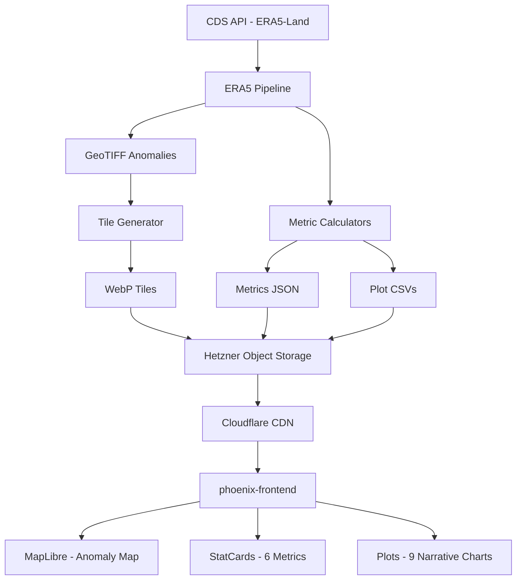

# Sprint 8 — Polish + Documentation + Cleanup


Production-quality finishing: E2E test suite, performance optimization (Lighthouse ≥90), header/footer/Impressum, architecture documentation, and removal of old code. After this sprint, the product is release-ready.

**Prerequisite**: Sprint 7 completed — site live with automated updates.

**Architecture reference**: See `plan/phoenix/00-architecture.md` for overall conventions.

## 1. Requirements & Constraints

- **REQ-001**: Playwright E2E test suite covering core user flows: city selection, date navigation, metrics display, narrative tab switching, deep linking
- **REQ-002**: E2E suite completes in <5 minutes in CI
- **REQ-003**: Lighthouse performance score ≥90 on production
- **REQ-004**: Initial page load <3 seconds on simulated 4G connection
- **REQ-005**: Header component with site title, brief description, and city search (moved from map overlay to header on wide screens)
- **REQ-006**: Footer component with Impressum link, data source attribution, and last-updated timestamp
- **REQ-007**: `/impressum` route with legal information page
- **REQ-008**: Lazy-load narrative section (code-split below the fold)
- **REQ-009**: Architecture documentation with Mermaid diagrams: data pipeline flow, frontend component hierarchy, Redux data flow
- **REQ-010**: Data format documentation: tile URL patterns, metrics JSON schema explanation, CSV column definitions
- **REQ-011**: Operations runbook: tile regeneration, cache purge, manual job execution, recovery procedures
- **REQ-012**: JSDoc comments on all exported TypeScript functions/interfaces
- **REQ-013**: Python docstrings on all public functions in `phoenix-backend/analysis/`
- **REQ-014**: Frontend test coverage ≥80%
- **REQ-015**: Backend test coverage ≥60%
- **REQ-016**: Old directories removable: `frontend/`, `analysis/`, `plan/botox/` can be deleted without breaking `phoenix-*/`
- **CON-001**: E2E tests run against the production build (`npm run build && npm run preview`)
- **CON-002**: No new features in this sprint — only quality, documentation, and cleanup
- **PAT-001**: Playwright page objects for reusable E2E selectors
- **GUD-001**: Documentation lives alongside code: architecture docs in `phoenix-frontend/docs/` and `phoenix-backend/docs/`

## 2. Implementation Steps

### Phase 1: E2E Test Suite

- GOAL-001: Comprehensive Playwright tests for all user-facing features

| Task | Description | Completed | Date |
|------|-------------|-----------|------|
| TASK-001 | Configure Playwright in `phoenix-frontend/`: `playwright.config.ts` with base URL pointing to preview server, 3 browser projects (chromium, firefox, webkit), screenshots on failure. | | |
| TASK-002 | Create `phoenix-frontend/e2e/page-objects/MapPage.ts` — page object with locators: map container, legend, date selector, city search input, city markers | | |
| TASK-003 | Create `phoenix-frontend/e2e/page-objects/MetricsPage.ts` — locators for metrics row and each stat card | | |
| TASK-004 | Create `phoenix-frontend/e2e/page-objects/NarrativePage.ts` — locators for tab navigation, plot containers | | |
| TASK-005 | Create `phoenix-frontend/e2e/city-selection.spec.ts` — tests: search for "Berlin", select from results, URL updates to `?city=berlin`, map centers on Berlin, metrics update, revisit URL directly → same state | | |
| TASK-006 | Create `phoenix-frontend/e2e/date-navigation.spec.ts` — tests: change month, tiles update (verify raster source URL changes), change year, boundary dates work (earliest 2016, latest month) | | |
| TASK-007 | Create `phoenix-frontend/e2e/metrics-display.spec.ts` — tests: 6 cards visible, values non-empty, change city → values update, no city → Germany-wide values | | |
| TASK-008 | Create `phoenix-frontend/e2e/narrative-tabs.spec.ts` — tests: 3 tabs visible, clicking "Verstehen" shows different content, plots render (SVG/canvas elements present), mobile viewport → accordion layout | | |
| TASK-009 | Create `phoenix-frontend/e2e/deep-linking.spec.ts` — tests: navigate to `/?city=muenchen`, München selected, metrics show München data, share URL works | | |
| TASK-010 | Verify: `npm run test:e2e` — all E2E tests pass in <5 minutes | | |

### Phase 2: Performance Optimization

- GOAL-002: Lighthouse ≥90, initial load <3s on 4G

| Task | Description | Completed | Date |
|------|-------------|-----------|------|
| TASK-011 | Lazy-load `NarrativeSection` via `React.lazy()` + `Suspense` — only load narrative components when user scrolls below metrics cards | | |
| TASK-012 | Optimize bundle: verify tree-shaking of D3 (import only used modules, not all of `d3`), check Observable Plot chunk size | | |
| TASK-013 | Add `loading="lazy"` or equivalent for narrative plot containers (intersection observer to trigger data fetch only when visible) | | |
| TASK-014 | Optimize tile loading: ensure MapLibre `rasterSource` has proper `tileSize: 256` and only requests tiles in viewport | | |
| TASK-015 | Run Lighthouse audit on production build. Record scores. Iterate if <90: common fixes include image optimization, font loading, CLS from layout shifts. | | |
| TASK-016 | Add `<meta>` viewport tags, lang="de", proper `<title>`, and SEO meta tags to `index.html` | | |

### Phase 3: Header, Footer, Impressum

- GOAL-003: Complete app shell with branding and legal compliance

| Task | Description | Completed | Date |
|------|-------------|-----------|------|
| TASK-017 | Create `src/components/layout/Header.tsx` — site title "Ziemlich Warm Hier", subtitle/description, on desktop: city search moved from map overlay to header. Sticky/fixed at top. Dark background matching `theme.colors.background`. | | |
| TASK-018 | Create `src/components/layout/Footer.tsx` — data source attribution ("Daten: ERA5-Land, Copernicus Climate Data Store"), last-updated display, link to Impressum, link to GitHub repo (optional). | | |
| TASK-019 | Create `src/components/layout/Impressum.tsx` — legal page with site operator information, privacy policy (no cookies, no tracking), data sources and licenses. | | |
| TASK-020 | Update `src/App.tsx` — add Header (top), Footer (bottom), `/impressum` route via react-router-dom. Adjust map height to account for header height. | | |
| TASK-021 | Create tests: `Header.test.tsx`, `Footer.test.tsx` — render, links work, responsive layout | | |

### Phase 4: Documentation

- GOAL-004: Comprehensive architecture and operations documentation

| Task | Description | Completed | Date |
|------|-------------|-----------|------|
| TASK-022 | Create `phoenix-frontend/docs/architecture.md` — Mermaid diagrams for: component hierarchy, Redux data flow (slice factory → selectors → components), data loading sequence (service → thunk → slice → selector → component) | | |
| TASK-023 | Create `phoenix-backend/docs/architecture.md` — Mermaid diagrams for: data pipeline flow (CDS API → ERA5 download → anomaly calculation → tile generation → upload), metrics calculation flow, provider protocol | | |
| TASK-024 | Create `phoenix-backend/docs/data-formats.md` — document all data contracts: tile URL pattern, metrics JSON schema with field descriptions, plot CSV formats with column descriptions, city correlation JSON | | |
| TASK-025 | Create `phoenix-backend/docs/operations-runbook.md` — procedures for: regenerating tiles for a specific month, purging CDN cache, manually running daily/monthly/yearly jobs, recovering from pipeline failure, adding a new data month | | |
| TASK-026 | Update root `README.md` or create `phoenix-frontend/README.md` and `phoenix-backend/README.md` with: project description, setup instructions, development workflow, deployment process | | |

### Phase 5: Code Quality + Coverage

- GOAL-005: JSDoc/docstrings, test coverage targets, code cleanup

| Task | Description | Completed | Date |
|------|-------------|-----------|------|
| TASK-027 | Add JSDoc comments to all exported functions and interfaces in `phoenix-frontend/src/` — focus on: services, store factories, hooks, utility functions, component props interfaces | | |
| TASK-028 | Add/verify Python docstrings on all public functions in `phoenix-backend/analysis/` — focus on: metric calculators, tile generator, export functions, provider protocol | | |
| TASK-029 | Fill test coverage gaps: identify untested paths via `npm run test:coverage` and `pytest --cov`, add tests until frontend ≥80% and backend ≥60% | | |
| TASK-030 | Update `vitest.config.ts` coverage thresholds to enforce minimums: `branches: 70, functions: 80, lines: 80, statements: 80` | | |
| TASK-031 | Update `pyproject.toml` coverage threshold: `fail_under = 60` | | |

### Phase 6: Cleanup + Verification

- GOAL-006: Remove old code, final verification

| Task | Description | Completed | Date |
|------|-------------|-----------|------|
| TASK-032 | Verify `phoenix-frontend/` and `phoenix-backend/` are fully self-contained — no imports or references to top-level `frontend/` or `analysis/` directories | | |
| TASK-033 | Verify that deleting `frontend/`, `analysis/`, `plan/botox/` does not break any `phoenix-*` tests | | |
| TASK-034 | Update `.github/skills/` — verify all 3 skills (`stats-section-cards`, `narrative-plot`, `data-services-integration`) reference `phoenix-*` paths, not old paths | | |
| TASK-035 | Remove old `.github/skills/` files that reference the old frontend structure (if any remain) | | |
| TASK-036 | Final verification: `cd phoenix-backend && pytest`, `cd phoenix-frontend && npm test`, `cd phoenix-frontend && npm run test:e2e`, `cd phoenix-frontend && npm run build` — all pass | | |

## 3. Alternatives

- **ALT-001**: Use Cypress instead of Playwright for E2E — rejected; Playwright is already in the dependency tree, supports 3 browsers, and has faster execution
- **ALT-002**: Use Storybook for component documentation — rejected; adds build complexity; JSDoc + living tests provide sufficient documentation for this project scale
- **ALT-003**: Use SSR (Next.js) for SEO — rejected; the site is a data visualization tool, not a content site; static SPA with meta tags is sufficient; SSR would require a runtime server
- **ALT-004**: Keep old code alongside phoenix indefinitely — rejected; maintaining two codebases for the same features creates confusion and technical debt. Clean removal once phoenix is verified.
- **ALT-005**: Use auto-generated API docs (TypeDoc) — nice-to-have but not essential; JSDoc + architecture docs provide better narrative documentation

## 4. Dependencies

- **DEP-001**: Sprint 7 completed (production site live)
- **DEP-002**: `@playwright/test` 1.58+ (already in devDependencies)
- **DEP-003**: No new npm packages

## 5. Files

### E2E Tests
- **FILE-001**: `phoenix-frontend/playwright.config.ts` — NEW (or updated from Sprint 1 scaffold)
- **FILE-002**: `phoenix-frontend/e2e/page-objects/MapPage.ts` — NEW
- **FILE-003**: `phoenix-frontend/e2e/page-objects/MetricsPage.ts` — NEW
- **FILE-004**: `phoenix-frontend/e2e/page-objects/NarrativePage.ts` — NEW
- **FILE-005**: `phoenix-frontend/e2e/city-selection.spec.ts` — NEW
- **FILE-006**: `phoenix-frontend/e2e/date-navigation.spec.ts` — NEW
- **FILE-007**: `phoenix-frontend/e2e/metrics-display.spec.ts` — NEW
- **FILE-008**: `phoenix-frontend/e2e/narrative-tabs.spec.ts` — NEW
- **FILE-009**: `phoenix-frontend/e2e/deep-linking.spec.ts` — NEW

### Layout Components
- **FILE-010**: `phoenix-frontend/src/components/layout/Header.tsx` — NEW
- **FILE-011**: `phoenix-frontend/src/components/layout/Footer.tsx` — NEW
- **FILE-012**: `phoenix-frontend/src/components/layout/Impressum.tsx` — NEW
- **FILE-013**: `phoenix-frontend/src/components/layout/__tests__/Header.test.tsx` — NEW
- **FILE-014**: `phoenix-frontend/src/components/layout/__tests__/Footer.test.tsx` — NEW

### Documentation
- **FILE-015**: `phoenix-frontend/docs/architecture.md` — NEW
- **FILE-016**: `phoenix-backend/docs/architecture.md` — NEW
- **FILE-017**: `phoenix-backend/docs/data-formats.md` — NEW
- **FILE-018**: `phoenix-backend/docs/operations-runbook.md` — NEW
- **FILE-019**: `phoenix-frontend/README.md` — NEW
- **FILE-020**: `phoenix-backend/README.md` — NEW

### Modified
- **FILE-021**: `phoenix-frontend/src/App.tsx` — MODIFY — add Header, Footer, Impressum route, lazy-load NarrativeSection
- **FILE-022**: `phoenix-frontend/vitest.config.ts` — MODIFY — coverage thresholds
- **FILE-023**: `phoenix-backend/pyproject.toml` — MODIFY — coverage threshold
- **FILE-024**: `phoenix-frontend/index.html` — MODIFY — meta tags, lang, title

### Skills (Modified)
- **FILE-025**: `.github/skills/stats-section-cards/SKILL.md` — MODIFY — verify phoenix paths
- **FILE-026**: `.github/skills/narrative-plot/SKILL.md` — MODIFY — verify phoenix paths
- **FILE-027**: `.github/skills/data-services-integration/SKILL.md` — MODIFY — verify phoenix paths

## 6. Testing

- **TEST-001**: `city-selection.spec.ts` — search "Berlin" → results appear → select → URL updates → map pans → metrics update
- **TEST-002**: `date-navigation.spec.ts` — change month → tiles update → change year → boundary validation
- **TEST-003**: `metrics-display.spec.ts` — 6 cards visible → values non-empty → city change updates values
- **TEST-004**: `narrative-tabs.spec.ts` — 3 tabs → click switches content → plots render → mobile accordion
- **TEST-005**: `deep-linking.spec.ts` — load `/?city=muenchen` → correct city selected → correct data displayed
- **TEST-006**: Lighthouse ≥90 on `esistwarm.jetzt` (performance, accessibility, best practices, SEO)
- **TEST-007**: `Header.test.tsx` — renders title, city search on desktop, responsive
- **TEST-008**: `Footer.test.tsx` — renders attribution, Impressum link
- **TEST-009**: Frontend coverage ≥80% (`npm run test:coverage`)
- **TEST-010**: Backend coverage ≥60% (`pytest --cov --cov-fail-under=60`)
- **TEST-011**: `phoenix-*` tests pass after deleting `frontend/`, `analysis/`, `plan/botox/`

## 7. Risks & Assumptions

### Risks
- **RISK-001**: E2E tests may be flaky due to tile loading timing — **Mitigation**: use Playwright's `waitForSelector` and network idle detection; increase timeout for map-related assertions
- **RISK-002**: Lighthouse score may be dragged down by MapLibre GL JS bundle size (~500KB) — **Mitigation**: MapLibre is critical for core functionality; focus optimization on code-splitting narrative section and lazy-loading non-critical resources
- **RISK-003**: Achieving 80% frontend coverage may require testing complex Observable Plot interactions — **Mitigation**: focus coverage on services, store, hooks, and utility functions (high value); plot component tests verify rendering without deep DOM asserting
- **RISK-004**: Removing old directories may break unrelated tooling (IDE config, CI scripts referencing old paths) — **Mitigation**: search for all references to `frontend/`, `analysis/`, `plan/botox/` before deletion

### Assumptions
- **ASSUMPTION-001**: The production site from Sprint 7 is stable and serving real data
- **ASSUMPTION-002**: Playwright browser binaries are installed in CI (`npx playwright install`)
- **ASSUMPTION-003**: Old `frontend/` and `analysis/` directories have no consumers outside those directories (no external scripts or CI workflows reference them)

## 8. Multi-Agent Execution Notes

### Execution Order
- **Phase 1** (E2E): Independent, do first (most complex)
- **Phase 2** (perf): Independent, can parallel with Phase 1
- **Phase 3** (Header/Footer): Can parallel with Phase 1 + 2
- **Phase 4** (docs): Can parallel with Phase 1–3
- **Phase 5** (coverage): Requires Phase 3 (new components need tests)
- **Phase 6** (cleanup): Requires all other phases complete

### Parallel Opportunities
- E2E tests (Phase 1) and documentation (Phase 4) are fully independent
- Performance optimization (Phase 2) and layout components (Phase 3) are independent
- Coverage work (Phase 5) benefits from all new code being complete

### Agent Context Requirements
- Read `phoenix-frontend/playwright.config.ts` (if exists from Sprint 1)
- Read `phoenix-frontend/src/App.tsx` for current app structure
- Read all sprint plans to understand feature scope for E2E tests
- Read `plan/phoenix/00-architecture.md` for architecture diagram content

### Validation Checkpoints
- [After TASK-010]: `npm run test:e2e` passes in <5 minutes
- [After TASK-015]: Lighthouse score ≥90
- [After TASK-021]: Header and footer render correctly, Impressum route works
- [After TASK-026]: Documentation complete and accurate
- [After TASK-031]: Coverage thresholds enforced
- [After TASK-036]: All tests pass, old code removable

## 9. Related Specifications / Further Reading

- `plan/phoenix/00-architecture.md` — Full architecture reference
- All sprint plans (1–7) — Feature scope for E2E test scenarios
- Playwright docs: https://playwright.dev/
- Lighthouse CI: https://github.com/GoogleChrome/lighthouse-ci

## 10. Code Reference

### 10.1 Playwright Configuration

**File**: `phoenix-frontend/playwright.config.ts` (to be created/updated)

```typescript
import { defineConfig, devices } from '@playwright/test';

export default defineConfig({
  testDir: './e2e',
  fullyParallel: true,
  forbidOnly: !!process.env.CI,
  retries: process.env.CI ? 2 : 0,
  workers: process.env.CI ? 1 : undefined,
  reporter: 'html',
  timeout: 30000,
  use: {
    baseURL: 'http://localhost:4173', // vite preview port
    trace: 'on-first-retry',
    screenshot: 'only-on-failure',
  },
  projects: [
    { name: 'chromium', use: { ...devices['Desktop Chrome'] } },
    { name: 'firefox', use: { ...devices['Desktop Firefox'] } },
    { name: 'webkit', use: { ...devices['Desktop Safari'] } },
    { name: 'mobile-chrome', use: { ...devices['Pixel 5'] } },
  ],
  webServer: {
    command: 'npm run build && npm run serve',
    port: 4173,
    reuseExistingServer: !process.env.CI,
  },
});
```

### 10.2 E2E Page Object Pattern

**File**: `phoenix-frontend/e2e/page-objects/MapPage.ts` (to be created)

```typescript
import type { Page, Locator } from '@playwright/test';

export class MapPage {
  readonly page: Page;
  readonly mapContainer: Locator;
  readonly dateSelector: Locator;
  readonly citySearchInput: Locator;
  readonly searchResults: Locator;
  readonly legend: Locator;

  constructor(page: Page) {
    this.page = page;
    this.mapContainer = page.locator('[data-testid="climate-map"]');
    this.dateSelector = page.locator('[data-testid="date-selector"]');
    this.citySearchInput = page.locator('[data-testid="city-search-input"]');
    this.searchResults = page.locator('[data-testid="city-search-results"]');
    this.legend = page.locator('[data-testid="map-legend"]');
  }

  async searchCity(name: string) {
    await this.citySearchInput.fill(name);
    await this.searchResults.waitFor({ state: 'visible' });
  }

  async selectCity(name: string) {
    await this.searchCity(name);
    await this.searchResults.getByText(name).first().click();
  }

  async selectMonth(year: number, month: number) {
    // Implementation depends on DateSelector UI
    await this.dateSelector.click();
    // ... select year and month
  }
}
```

### 10.3 Lazy-Load NarrativeSection Pattern

**File**: `phoenix-frontend/src/App.tsx` (modification)

```typescript
import { lazy, Suspense } from 'react';
import { LoadingSkeleton } from './components/common/LoadingSkeleton';

const NarrativeSection = lazy(() =>
  import('./components/narrative/NarrativeSection').then(m => ({ default: m.NarrativeSection }))
);

// In render:
<Suspense fallback={<LoadingSkeleton />}>
  <NarrativeSection />
</Suspense>
```

### 10.4 Architecture Diagram (Mermaid)

**File**: `phoenix-frontend/docs/architecture.md` (to be created — include this diagram)


